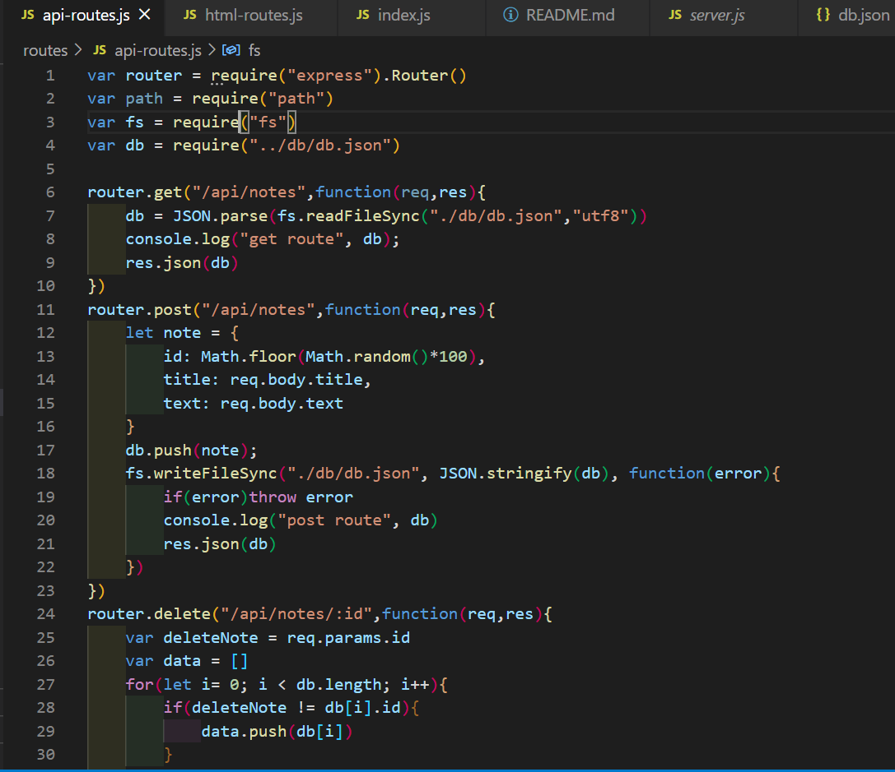
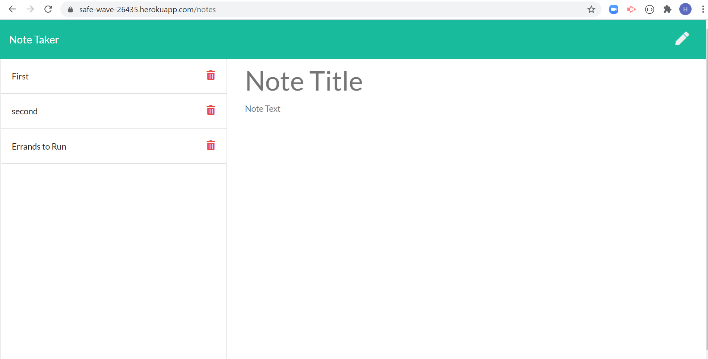

# CLI-Note-Taker

## Author

Heather Stolz

## License

This project is protected under the MIT license.
   

## Table of Contents:

* [Description](#description)
* [Installation](#installation)
* [Dependancies](#dependancies)
* [Usage](#usage)
* [Contributors](#contributors)
* [Images](#images)
* [Questions](#questions)

## Description

An application that can be used to write, save, and delete notes. This application uses an express backend and saves and retrieves note data from a JSON file.

## Installation

Please run these commands to install dependancies for this project: npm i

## Dependancies

* express
* fs

## Usage

For users that need to keep track of a lot of information, it's easy to forget or be unable to recall something important. Being able to take persistent notes allows users to have written information available when needed.

## Contributors

Heather Stolz and Sangeetha (tutor)

## Images

## Questions

If you have any questions regarding this project, you can find me at [Wanderingtech](https://github.com/Wanderingtech) 

and/or at heather86lyn@gmail.com.